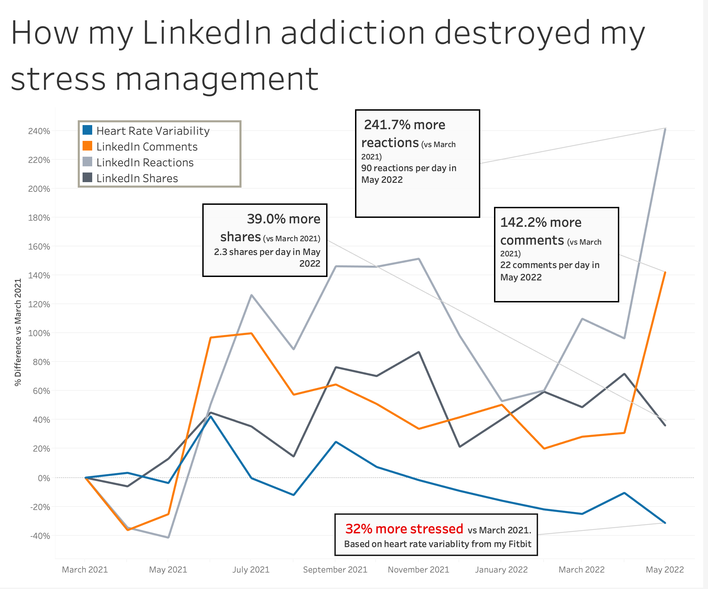

# Timeline analysis of your social media use and fitness data

This repo is a Python script that gets your LinkedIn and Fitbit data into the same schema.
This should be flexible enough to incorporate more sources going forward. 

The schema is stored in a `namedtuple` called `Event`

- source  -- either Fitbit or LinkedIn
- metric_name -- things like comments, shares, hrv, hr, etc 
- timestamp -- the timestamp when this metric occured
- metric_value -- the double value of the metric
- content -- the content of the comment or share for LinkedIn, `NULL` for Fitbit

Request your Fitbit data from https://www.fitbit.com/settings/data/export 
After you get your export, dump it into `data/fitbit` and unzip it. (this usually takes 30ish minutes) 

Request your LinkedIn data from https://www.linkedin.com/psettings/member-data (this can take up to TWO DAYS!)
After you get your export, unzip an dump it into `data/linkedin` in the root of this repo

After you have both exports in the right place,

Run `pip install -r requirements.txt` to install Pandas if you don't have pandas installed

update your `YOUR_FITBIT_NAME` to whatever it shows in your path. Mine was `ZacharyWilson` 

Once that is updated. 
Run the script with `python runner.py`

This will create three datasets
`output/all_events_on_timeline.csv`
`output/daily_aggregates.csv`
`output/pivoted.csv`

You can use the `pivoted.csv` to create fancy charts like this in Tableau. My data is in the repo at `zachs_pivoted_data.csv`
